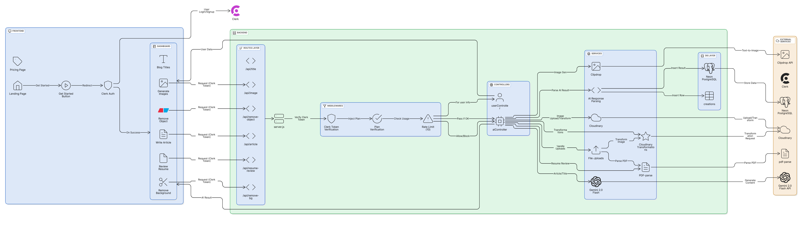
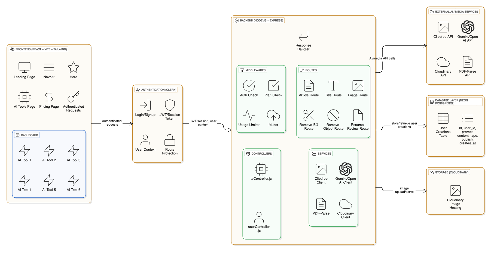

<div align="center">
  

  <p><i>Let Ai be your muse</i></p>
<p align="center">
  
  
  
  
  
  
  
  
</p>

</div>

---

## 📌 Overview

**Muse.ai** is a full-stack AI SaaS platform providing six powerful, utility-focused AI tools designed for content creators and professionals:

* ✍️ **AI Article Generator**
* 🪄 **Blog Title Generator**
* 🎨 **AI Image Generator**
* ✂️ **Background Remover**
* 🔍 **Object Remover**
* 📄 **Resume Reviewer**

It is architected as a modular, scalable SaaS application with separate repositories for maximum deployment flexibility.

---

## 🏗️ Repositories & Architecture

Muse.ai is logically split into two service layers. This document serves as the **main documentation** for the entire project.

### 🔹 Frontend Repository
👉 `https://github.com/aradhyaxd-git/muse_ai_frontend`

### 🔹 Backend Repository
👉 `https://github.com/aradhyaxd-git/muse_ai_backend`

<div align="center">
### 🧬 **System Architecture Overview**


### 🧬 **Detailed System Design Diagram**

</div>

---

## 🧠 Core Tech Stack

The platform is built on a modern, high-performance stack for resilience and speed. Visual assets from the local `/assets` directory are used here to represent core technologies.

| Layer | Primary Technology | Description | Asset Used (Relative Path) |
| :--- | :--- | :--- | :--- |
| **Frontend** | React + Vite + Tailwind CSS | Component-based UI for fast, dynamic rendering. |  |
| **Backend** | Node.js + Express | Highly scalable server-side environment for API routing. |   |
| **AI/ML** | Google Gemini | Core LLM for all text-based generation and analysis. |  |
| **DB** | Neon PostgreSQL | Serverless relational database for persistent data storage. | |

* **Additional Frontend:** Framer Motion, React Router DOM.
* **Additional Backend:** Cloudinary, ClipDrop, PDF-Parse, Multer.

---

## ✨ AI Tooling & Features

Muse.ai provides six distinct tools, managed via a free/premium authorization model:

| Tool | Capability | API Service | Free Plan Limit |
| :--- | :--- | :--- | :--- |
| **1. Article Generator** | Long-form content generation. | Gemini | 10 Uses |
| **2. Blog Title Generator** | Catchy, SEO-optimized headings. | Gemini | 10 Uses |
| **3. AI Image Generator** | Text-to-Image synthesis. | ClipDrop | **Premium Only** |
| **4. Background Remover** | Cloudinary background removal transformation. | Cloudinary | **Premium Only** |
| **5. Object Remover** | Cloudinary `gen_remove` transformation. | Cloudinary | **Premium Only** |
| **6. Resume Review** | Parses PDF (PDF-Parse) and evaluates strengths/improvements (Gemini). | PDF-Parse + Gemini | **Premium Only** |

---

## 🔐 Authentication & API Flow

Muse.ai uses **Clerk** for authentication and authorization.

### Middleware Flow

1.  **Clerk Token Validation:** Verifies the user's session token.
2.  **Request Assignment:** Assigns user data: `req.auth`, `req.plan`, `req.free_usage`.
3.  **Usage Limiter:** Checks the `free_usage` count against the limit for free-tier tools.
4.  **Multer Processing:** Handles file uploads (images/PDFs) before controller logic.
5.  **Controller Logic:** Executes the respective AI/API call.

### 🌐 API Endpoints

| Feature | Endpoint | Method | Authorization Required |
| :--- | :--- | :--- | :--- |
| Generate Article | `/api/article` | POST | Yes (Free Usage Check) |
| Generate Title | `/api/blog-title` | POST | Yes (Free Usage Check) |
| Generate Image | `/api/generate-image` | POST | Premium Only |
| Remove Background | `/api/remove-bg` | POST | Premium Only |
| Remove Object | `/api/remove-object` | POST | Premium Only |
| Review Resume | `/api/review-resume` | POST | Premium Only |

---

## ⚙️ Local Setup and Installation

Follow these steps to get a copy of the project running locally.

### 1. Clone Repositories

```bash
git clone [https://github.com/aradhyaxd-git/muse_ai_frontend](https://github.com/aradhyaxd-git/muse_ai_frontend) muse-frontend
git clone [https://github.com/aradhyaxd-git/muse_ai_backend](https://github.com/aradhyaxd-git/muse_ai_backend) muse-backend 
```


### 2. Configure Environment Variables

Create separate `.env` files in both the `muse-frontend` and `muse-backend` directories.

| Component | Variable | Description |
| :--- | :--- | :--- |
| **Frontend** | `VITE_CLERK_PUBLISHABLE_KEY` | Clerk Public Key |
| | `VITE_BACKEND_URL` | e.g., `http://localhost:5000` |
| **Backend** | `PORT` | e.g., `5000` |
| | `CLERK_SECRET_KEY` | Clerk Secret Key |
| | `NEON_DB_URL` | PostgreSQL Connection String |
| | `GEMINI_API_KEY` | Google Gemini API Key |
| | `CLIPDROP_API_KEY` | ClipDrop API Key |
| | `CLOUDINARY_CLOUD_NAME` | Cloudinary Account Name |
| | `CLOUDINARY_API_KEY` | Cloudinary API Key |
| | `CLOUDINARY_API_SECRET` | Cloudinary Secret |


### 3. Run Frontend & Backend

**A. Backend Setup**
```bash
cd muse-backend
npm install
npm start 
```

The server will start on the specified PORT.

**A. Backend Setup**

```bash
cd muse-backend
npm install
npm run dev 
```

The client application will typically open at http://localhost:5173 (or the port specified by Vite).


---

## 📄 License & Acknowledgements

This project is licensed under the **MIT License**.

Powered by:

* 🔒 **Clerk**
* 💾 **Neon**
* ☁️ **Cloudinary**
* 🧠 **Google Gemini**
* 🎨 **Clipdrop**
* ⚛️ **React**
* 🚀 **Express**
* ⚡ **Vite**

<div align="center"> <b>Developed with ❤️ by Aradhya</b> </div>
